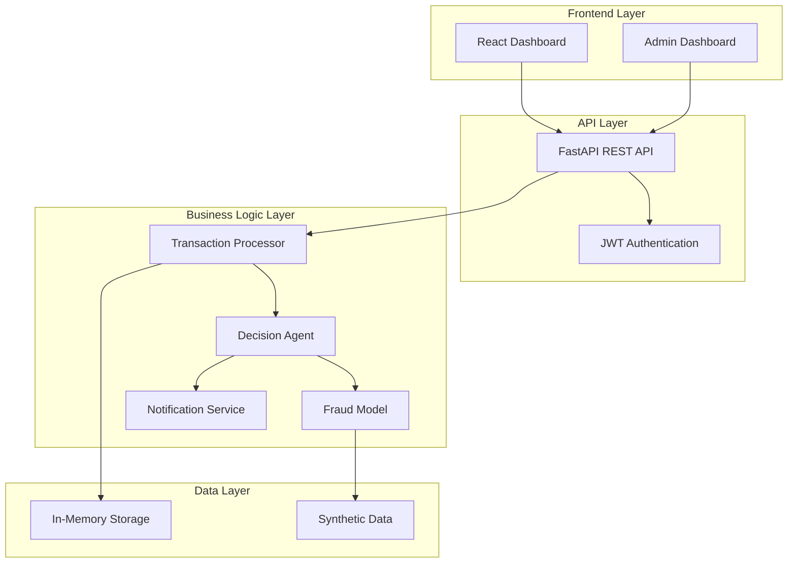
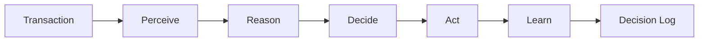
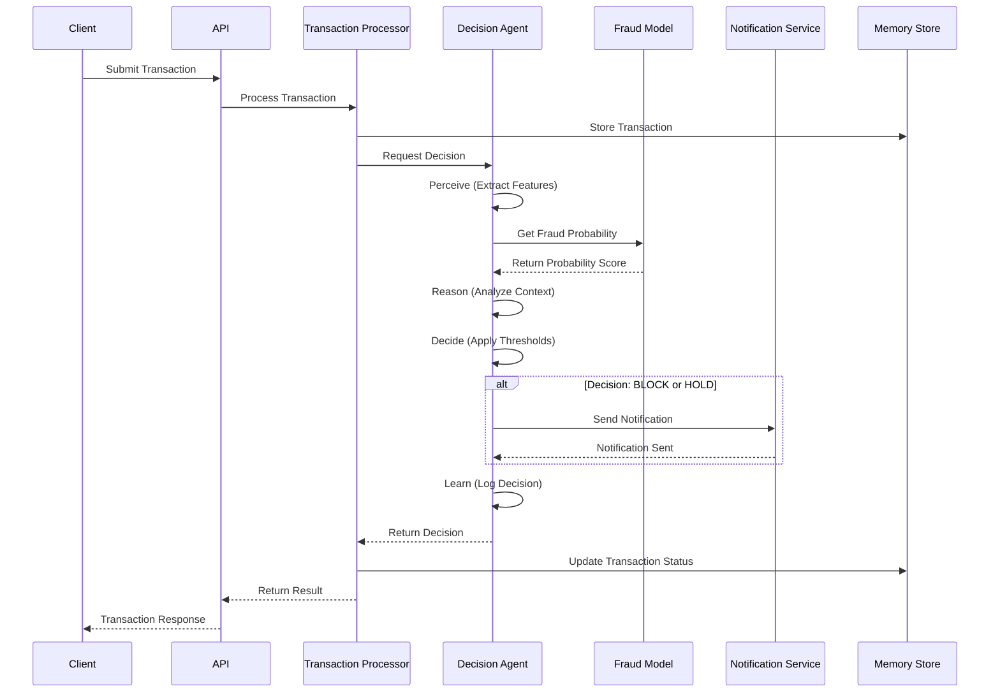
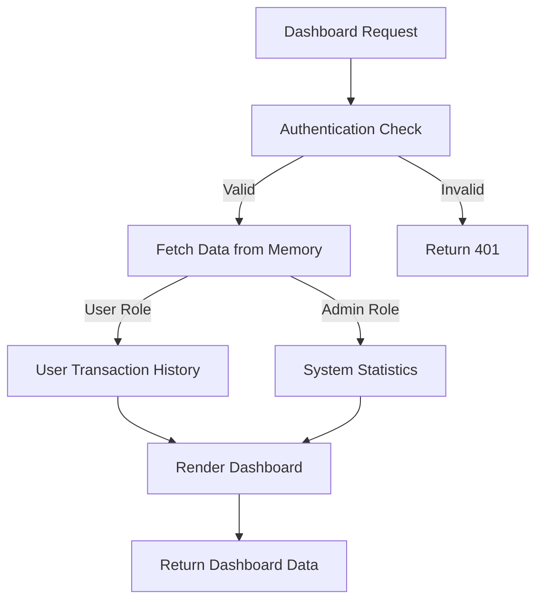

# System Design Document: VerifAI Fraud Detection System

## Design Overview

VerifAI is a prototype-grade fraud detection system implementing an agentic AI approach to autonomous transaction evaluation. The system follows a layered monolithic architecture with a FastAPI backend, React frontend, and an agentic decision pipeline that processes transactions through a structured Perceive → Reason → Decide → Act → Learn (PRDAL) workflow.

The design prioritizes demonstration clarity and functional completeness over production scalability, using in-memory storage, synthetic data, and hardcoded thresholds to create a working proof-of-concept that showcases agentic AI capabilities in financial fraud detection.

## Architectural Principles

### Core Design Principles

1. **Agentic Autonomy**: The system makes independent decisions without human intervention using structured reasoning
2. **Prototype Simplicity**: Favor clear, demonstrable functionality over production complexity
3. **Layered Separation**: Clear separation between presentation, business logic, and data layers
4. **Stateless Operations**: JWT-based authentication with no server-side session state
5. **Synthetic Safety**: All data and operations use synthetic inputs to prevent real-world impact

### Design Constraints

1. **In-Memory Persistence**: All data stored in application memory, lost on restart
2. **Hardcoded Configuration**: Decision thresholds and model parameters are fixed
3. **Monolithic Deployment**: Single application instance with no distributed components
4. **Demonstration Scope**: Designed for evaluation and demonstration, not production load

## High-Level Architecture



### Architecture Layers

1. **Frontend Layer**: React-based user and admin dashboards
2. **API Layer**: FastAPI REST endpoints with JWT authentication
3. **Business Logic Layer**: Core fraud detection and decision-making components
4. **Data Layer**: In-memory storage with synthetic data sources

## Component Breakdown

### Transaction Processor
**Purpose**: Ingests, validates, and manages transaction lifecycle
**Responsibilities**:
- Transaction format validation
- In-memory storage management
- Transaction status tracking
- Integration with Decision Agent

**Key Interfaces**:
```python
class TransactionProcessor:
    def ingest_transaction(self, transaction: Transaction) -> TransactionResult
    def get_transaction_status(self, transaction_id: str) -> TransactionStatus
    def get_transaction_history(self, user_id: str) -> List[Transaction]
```

### Decision Agent (Agentic AI Core)
**Purpose**: Implements autonomous decision-making using PRDAL workflow
**Responsibilities**:
- Perceive: Extract relevant transaction features
- Reason: Analyze fraud probability and context
- Decide: Apply hardcoded thresholds to determine action
- Act: Execute decision and trigger notifications
- Learn: Log decision outcomes (no model updates)

**PRDAL Workflow Implementation**:
```python
class DecisionAgent:
    def perceive(self, transaction: Transaction) -> TransactionFeatures
    def reason(self, features: TransactionFeatures) -> ReasoningContext
    def decide(self, context: ReasoningContext) -> Decision
    def act(self, decision: Decision, transaction: Transaction) -> ActionResult
    def learn(self, outcome: ActionResult) -> None  # Logging only
```

**Decision Logic**:
- Fraud Probability < 0.3 → APPROVE
- Fraud Probability 0.3-0.7 → HOLD  
- Fraud Probability > 0.7 → BLOCK

### Fraud Model
**Purpose**: XGBoost-based fraud probability estimation
**Responsibilities**:
- Feature extraction from transaction data
- Fraud probability calculation (0.0-1.0 range)
- Model inference using pre-trained synthetic data model
- Graceful handling of missing features

**Model Specifications**:
- Algorithm: XGBoost Classifier
- Training Data: Synthetic transaction dataset
- Features: Transaction amount, merchant category, time patterns, user history
- Output: Probability score between 0.0 and 1.0
- Performance Target: <100ms inference time

### Notification Service
**Purpose**: Email-based user communication
**Responsibilities**:
- Email composition and delivery
- Template management for different decision types
- Delivery status tracking
- Error handling for failed notifications

**Notification Rules**:
- BLOCK decisions → Immediate email alert
- HOLD decisions → Email notification
- APPROVE decisions → No notification

### Dashboard Service
**Purpose**: Web-based user and admin interfaces
**Responsibilities**:
- User transaction history display
- Admin system metrics and monitoring
- Real-time status updates
- Authentication integration

**User Dashboard Features**:
- Personal transaction history
- Transaction status and details
- Fraud probability display
- Decision reasoning explanation

**Admin Dashboard Features**:
- System-wide transaction statistics
- Fraud detection performance metrics
- Decision distribution analytics
- System health monitoring

### Authentication Service
**Purpose**: JWT-based stateless authentication
**Responsibilities**:
- User credential validation
- JWT token generation and validation
- Role-based access control (user/admin)
- Token expiration management

## Agentic AI Design

### PRDAL Workflow Architecture

The Decision Agent implements a structured agentic workflow:



### Perceive Phase
**Objective**: Extract and normalize relevant features from transaction data
**Implementation**:
- Parse transaction fields (amount, merchant, timestamp, user_id)
- Calculate derived features (time_of_day, day_of_week, amount_percentile)
- Retrieve user transaction history from memory
- Handle missing or invalid data with defaults

### Reason Phase  
**Objective**: Analyze transaction context and fraud indicators
**Implementation**:
- Invoke Fraud Model for probability estimation
- Analyze transaction patterns against user history
- Consider temporal factors (unusual timing, frequency)
- Generate reasoning context with confidence metrics

### Decide Phase
**Objective**: Apply decision logic to determine transaction action
**Implementation**:
- Apply hardcoded probability thresholds
- Generate decision with confidence score
- Create decision reasoning explanation
- Prepare action parameters

### Act Phase
**Objective**: Execute decision and trigger appropriate responses
**Implementation**:
- Update transaction status in memory
- Trigger notification service for BLOCK/HOLD decisions
- Log decision details with timestamp
- Return action result to Transaction Processor

### Learn Phase
**Objective**: Record decision outcomes for analysis (no model updates)
**Implementation**:
- Log decision details to in-memory decision history
- Record reasoning chain for audit purposes
- Update system metrics and statistics
- No model retraining or threshold adjustment

## Data Flow & Control Flow

### Transaction Processing Flow



### Dashboard Data Flow



## API Design Overview

### REST Endpoint Structure

**Authentication Endpoints**:
- `POST /auth/login` - User authentication
- `POST /auth/refresh` - Token refresh
- `POST /auth/logout` - Token invalidation

**Transaction Endpoints**:
- `POST /transactions` - Submit new transaction
- `GET /transactions/{id}` - Get transaction details
- `GET /transactions` - Get user transaction history

**Dashboard Endpoints**:
- `GET /dashboard/user` - User dashboard data
- `GET /dashboard/admin` - Admin dashboard data (admin role required)

**System Endpoints**:
- `GET /health` - System health check
- `GET /metrics` - System performance metrics (admin role required)

### Request/Response Formats

**Transaction Submission**:
```json
{
  "user_id": "user123",
  "amount": 150.00,
  "merchant": "Online Store",
  "merchant_category": "retail",
  "timestamp": "2024-01-15T10:30:00Z"
}
```

**Transaction Response**:
```json
{
  "transaction_id": "txn_456",
  "status": "APPROVED",
  "fraud_probability": 0.15,
  "decision_reasoning": "Low risk transaction within normal patterns",
  "timestamp": "2024-01-15T10:30:01Z"
}
```

### Error Response Format
```json
{
  "error": "VALIDATION_ERROR",
  "message": "Invalid transaction amount",
  "details": {
    "field": "amount",
    "constraint": "must be positive number"
  }
}
```

## Data Management Design

### In-Memory Storage Structure

**Transaction Store**:
```python
transactions: Dict[str, Transaction] = {}
user_transactions: Dict[str, List[str]] = {}  # user_id -> transaction_ids
```

**Decision History**:
```python
decisions: Dict[str, DecisionRecord] = {}  # transaction_id -> decision
decision_metrics: SystemMetrics = SystemMetrics()
```

**User Management**:
```python
users: Dict[str, User] = {}  # user_id -> user_data
admin_users: Set[str] = set()  # admin user_ids
```

### Data Models

**Transaction Model**:
```python
@dataclass
class Transaction:
    transaction_id: str
    user_id: str
    amount: float
    merchant: str
    merchant_category: str
    timestamp: datetime
    status: TransactionStatus
    fraud_probability: Optional[float] = None
```

**Decision Record**:
```python
@dataclass
class DecisionRecord:
    transaction_id: str
    decision: Decision
    fraud_probability: float
    reasoning: str
    confidence: float
    timestamp: datetime
    processing_time_ms: int
```

### Synthetic Data Generation

**Transaction Generator**:
- Normal transactions: 85% of dataset
- Suspicious transactions: 10% of dataset  
- Fraudulent transactions: 5% of dataset
- Feature distributions based on realistic financial patterns
- User behavior patterns with consistent spending habits

## Security Design

### Authentication Architecture

**JWT Token Structure**:
```json
{
  "sub": "user123",
  "role": "user",
  "exp": 1642694400,
  "iat": 1642608000,
  "iss": "verifai-system"
}
```

**Security Measures**:
1. **Password Hashing**: bcrypt with salt for stored credentials
2. **Token Validation**: Signature verification and expiration checking
3. **Input Validation**: Parameter sanitization to prevent injection attacks
4. **HTTPS Enforcement**: All API communications over encrypted connections
5. **Role-Based Access**: Admin endpoints restricted to admin role tokens

### Security Limitations (Prototype Constraints)

1. **No Encryption at Rest**: In-memory data is not encrypted
2. **Basic Authentication**: No multi-factor authentication
3. **Limited Audit Logging**: Basic decision logging only
4. **No Advanced Threat Protection**: No protection against sophisticated attacks
5. **Development Secrets**: Hardcoded JWT secrets (not production-ready)

## Error Handling & Observability

### Error Handling Strategy

**Transaction Processing Errors**:
- Invalid format → 400 Bad Request with field details
- Authentication failure → 401 Unauthorized
- Insufficient permissions → 403 Forbidden
- Transaction not found → 404 Not Found
- Model inference failure → 500 Internal Server Error with retry logic

**Graceful Degradation**:
- Model unavailable → Default to HOLD decision with manual review flag
- Notification failure → Log error, continue transaction processing
- Memory storage full → Implement LRU eviction for oldest transactions

### Logging and Monitoring

**Decision Logging**:
```python
@dataclass
class DecisionLog:
    timestamp: datetime
    transaction_id: str
    decision_path: List[str]  # PRDAL workflow steps
    fraud_probability: float
    decision: Decision
    processing_time_ms: int
    model_version: str
```

**System Metrics**:
- Transaction processing rate (transactions/second)
- Decision distribution (APPROVE/HOLD/BLOCK percentages)
- Model inference latency (p50, p95, p99)
- Error rates by endpoint and error type
- Memory usage and transaction count

**Health Checks**:
- Model availability and response time
- Memory storage capacity
- Notification service connectivity
- Authentication service status

## Design Trade-offs & Limitations

### Prototype Trade-offs

**Simplicity vs. Scalability**:
- **Chosen**: In-memory storage for simplicity and demonstration clarity
- **Trade-off**: Limited to single instance, data lost on restart
- **Rationale**: Prototype focus on functionality demonstration over production scalability

**Fixed vs. Configurable**:
- **Chosen**: Hardcoded decision thresholds (0.3, 0.7)
- **Trade-off**: No runtime configuration or A/B testing capability
- **Rationale**: Predictable behavior for demonstration and evaluation

**Synthetic vs. Real Data**:
- **Chosen**: Synthetic training data and test transactions
- **Trade-off**: Model may not reflect real-world fraud patterns
- **Rationale**: Safety and compliance requirements for prototype system

### Performance Limitations

**Memory Constraints**:
- Transaction history limited by available RAM
- No persistence across system restarts
- LRU eviction when memory limits approached

**Concurrency Limitations**:
- Single-threaded decision processing
- No distributed processing capability
- Limited to demonstration-level concurrent users

**Model Limitations**:
- Static model with no continuous learning
- Fixed feature set with no dynamic feature engineering
- No model versioning or A/B testing capability

## Extensibility Considerations

### Future Enhancement Points

**Data Persistence Layer**:
- Database integration points identified in Transaction Processor
- Abstract storage interface allows easy database backend substitution
- Migration path from in-memory to persistent storage

**Model Management**:
- Model interface designed for easy algorithm substitution
- Feature extraction pipeline can be extended with new features
- Decision threshold configuration can be externalized

**Notification Channels**:
- Notification Service interface supports multiple channels
- WhatsApp integration prepared but inactive
- SMS and push notification channels can be added

**Microservices Migration**:
- Component interfaces designed for potential service boundaries
- Clear separation of concerns enables independent deployment
- API contracts support distributed system evolution

### Integration Points

**External System Integration**:
- Transaction Processor can accept external transaction feeds
- Decision Agent can integrate with external risk scoring systems
- Notification Service can integrate with enterprise communication platforms

**Monitoring and Observability**:
- Logging interfaces prepared for external log aggregation
- Metrics collection points identified for monitoring systems
- Health check endpoints support load balancer integration

This design provides a solid foundation for the VerifAI prototype while maintaining clear paths for future production evolution.

## Correctness Properties

*A property is a characteristic or behavior that should hold true across all valid executions of a system-essentially, a formal statement about what the system should do. Properties serve as the bridge between human-readable specifications and machine-verifiable correctness guarantees.*

### Property 1: Transaction Ingestion and Storage
*For any* valid transaction submitted to the system, the Transaction_Processor should ingest it immediately and store it in memory where it remains accessible throughout system operation.
**Validates: Requirements FR-1.1, FR-1.4, FR-1.5**

### Property 2: Transaction Validation
*For any* transaction data (valid or invalid), the Transaction_Processor should validate the format and required fields, rejecting invalid transactions with descriptive error messages while accepting valid ones.
**Validates: Requirements FR-1.2, FR-1.3**

### Property 3: Fraud Probability Range
*For any* valid transaction processed by the Fraud_Model, the calculated fraud probability score should be between 0.0 and 1.0 inclusive.
**Validates: Requirements FR-2.1**

### Property 4: Model Graceful Degradation
*For any* transaction with missing features, the Fraud_Model should handle them gracefully using default values without failing or crashing.
**Validates: Requirements FR-2.4**

### Property 5: Model Performance Timing
*For any* transaction data provided to the Fraud_Model, the probability score should be returned within 100ms.
**Validates: Requirements FR-2.5, NFR-1.3**

### Property 6: PRDAL Workflow Execution
*For any* transaction requiring a decision, the Decision_Agent should execute all workflow steps (Perceive → Reason → Decide → Act → Learn) in the correct sequence.
**Validates: Requirements FR-3.1**

### Property 7: Threshold-Based Decision Logic
*For any* fraud probability score, the Decision_Agent should decide APPROVE when probability < 0.3, HOLD when 0.3 ≤ probability ≤ 0.7, and BLOCK when probability > 0.7.
**Validates: Requirements FR-3.2, FR-3.3, FR-3.4**

### Property 8: Decision Recording
*For any* decision made by the Decision_Agent, the decision should be recorded with timestamp, reasoning, and all required metadata.
**Validates: Requirements FR-3.6**

### Property 9: Decision-Based Notifications
*For any* transaction decision, the Notification_Service should send email notifications for BLOCK and HOLD decisions, but not for APPROVE decisions.
**Validates: Requirements FR-4.1, FR-4.2, FR-4.3**

### Property 10: Notification Content Completeness
*For any* notification sent by the Notification_Service, it should include transaction ID, decision, and timestamp.
**Validates: Requirements FR-4.5**

### Property 11: User Transaction History Access
*For any* user accessing their dashboard, the Dashboard_Service should display their complete transaction history with transaction ID, amount, timestamp, and status.
**Validates: Requirements FR-5.1, FR-5.2**

### Property 12: Transaction Detail Display
*For any* transaction viewed in detail, the Dashboard_Service should display fraud probability and decision reasoning.
**Validates: Requirements FR-5.3**

### Property 13: Transaction Filtering
*For any* filter criteria (status, date range) applied by users, the Dashboard_Service should return only transactions matching those criteria.
**Validates: Requirements FR-5.5**

### Property 14: Admin Statistics Accuracy
*For any* set of system transactions, the admin dashboard should display accurate system-wide statistics including total transactions, approval rates, and fraud detection rates.
**Validates: Requirements FR-6.1, FR-6.2**

### Property 15: Time-Series Metrics
*For any* time period, the Dashboard_Service should calculate and display accurate transaction volume metrics for that period.
**Validates: Requirements FR-6.3**

### Property 16: Performance Metrics Display
*For any* system operation, the admin dashboard should display accurate model performance metrics including response times.
**Validates: Requirements FR-6.4**

### Property 17: Decision Log Access
*For any* decision made by the system, admins should be able to access detailed logs containing the complete decision reasoning.
**Validates: Requirements FR-6.5**

### Property 18: Authentication Round Trip
*For any* valid user credentials, the Auth_Service should validate them and issue a JWT token with appropriate claims that can be successfully validated on subsequent requests.
**Validates: Requirements FR-7.1, FR-7.2, FR-7.3**

### Property 19: Role-Based Token Claims
*For any* authenticated user, the JWT token should contain the correct role information (user or admin) that matches their account type.
**Validates: Requirements FR-7.4**

### Property 20: Protected Endpoint Access Control
*For any* protected endpoint access attempt, the system should require valid JWT authentication and reject requests with invalid or missing tokens.
**Validates: Requirements FR-7.5**

### Property 21: HTTP Status Code Consistency
*For any* API request, the system should return appropriate HTTP status codes that correctly reflect the request outcome (success, client error, server error).
**Validates: Requirements FR-8.4**

### Property 22: JSON Format Consistency
*For any* API request or response, the payload should be valid JSON format.
**Validates: Requirements FR-8.5**

### Property 23: End-to-End Processing Performance
*For any* individual transaction, the system should complete end-to-end processing within 200ms.
**Validates: Requirements NFR-1.1**

### Property 24: Error Logging Completeness
*For any* component failure or error condition, the system should log appropriate error information without exposing sensitive data.
**Validates: Requirements NFR-2.2, NFR-4.5**

### Property 25: Input Validation Resilience
*For any* invalid or malicious input, the system should handle it gracefully without crashing and should properly sanitize inputs to prevent injection attacks.
**Validates: Requirements NFR-2.3, NFR-4.2**

### Property 26: System Recovery
*For any* temporary failure that can be automatically recovered, the system should attempt recovery without manual intervention.
**Validates: Requirements NFR-2.4**

### Property 27: Data Consistency
*For any* concurrent operations on the in-memory storage, the system should maintain data consistency and prevent race conditions.
**Validates: Requirements NFR-2.5**

### Property 28: Password Security
*For any* user password stored in the system, it should be properly hashed and never stored or logged in plaintext.
**Validates: Requirements NFR-4.4**

## Error Handling

### Error Categories and Responses

**Input Validation Errors**:
- Invalid transaction format → 400 Bad Request with field-specific error details
- Missing required fields → 400 Bad Request with list of missing fields
- Invalid data types → 400 Bad Request with type conversion guidance
- Out-of-range values → 400 Bad Request with acceptable range information

**Authentication and Authorization Errors**:
- Invalid credentials → 401 Unauthorized with generic error message
- Expired JWT token → 401 Unauthorized with token refresh guidance
- Missing JWT token → 401 Unauthorized with authentication requirement
- Insufficient permissions → 403 Forbidden with required role information

**System Processing Errors**:
- Model inference failure → 500 Internal Server Error with retry guidance, fallback to HOLD decision
- Memory storage full → 503 Service Unavailable with LRU eviction triggered
- Notification service failure → Log error, continue transaction processing
- Dashboard data retrieval failure → 500 Internal Server Error with cached data fallback

**Resource Not Found Errors**:
- Transaction not found → 404 Not Found with transaction ID
- User not found → 404 Not Found with user ID
- Invalid endpoint → 404 Not Found with available endpoints list

### Error Recovery Mechanisms

**Automatic Recovery**:
- Model inference timeout → Retry once, then fallback to HOLD decision
- Notification delivery failure → Retry with exponential backoff (3 attempts)
- Memory pressure → Automatic LRU eviction of oldest transactions
- Temporary service unavailability → Circuit breaker pattern with fallback responses

**Graceful Degradation**:
- Model unavailable → All transactions default to HOLD with manual review flag
- Dashboard service failure → Return cached data with staleness indicator
- Authentication service failure → Allow read-only access with warning message
- Notification service failure → Log notification intent, continue processing

## Testing Strategy

### Dual Testing Approach

The VerifAI system requires both unit testing and property-based testing to ensure comprehensive coverage:

**Unit Tests**: Focus on specific examples, edge cases, and integration points
- Authentication flow with specific valid/invalid credential examples
- Transaction processing with known fraud patterns
- Dashboard rendering with specific data sets
- Error handling with specific failure scenarios
- API endpoint integration with sample requests/responses

**Property-Based Tests**: Verify universal properties across all inputs using randomized testing
- Generate random transactions to test fraud detection properties
- Generate random user credentials to test authentication properties
- Generate random API requests to test input validation properties
- Generate random system states to test consistency properties
- Generate random failure scenarios to test recovery properties

### Property-Based Testing Configuration

**Testing Framework**: Use Hypothesis (Python) for property-based testing
**Test Configuration**:
- Minimum 100 iterations per property test (due to randomization)
- Each property test references its design document property
- Tag format: **Feature: verifai-fraud-detection, Property {number}: {property_text}**

**Example Property Test Structure**:
```python
@given(transactions=transaction_strategy())
@settings(max_examples=100)
def test_fraud_probability_range(transactions):
    """Feature: verifai-fraud-detection, Property 3: Fraud Probability Range"""
    for transaction in transactions:
        probability = fraud_model.calculate_probability(transaction)
        assert 0.0 <= probability <= 1.0
```

### Test Coverage Requirements

**Correctness Properties**: Each of the 28 correctness properties must be implemented as a separate property-based test
**Unit Test Coverage**: Minimum 80% code coverage for all components
**Integration Testing**: End-to-end API testing for all user workflows
**Performance Testing**: Response time validation for all timed requirements
**Security Testing**: Input validation and authentication bypass attempts

### Test Data Strategy

**Synthetic Transaction Generation**:
- Normal transactions (85%): Realistic amounts, common merchants, regular timing
- Suspicious transactions (10%): Unusual patterns, high amounts, irregular timing  
- Fraudulent transactions (5%): Known fraud indicators, stolen card patterns
- Edge cases: Zero amounts, negative amounts, missing fields, invalid formats

**User Data Generation**:
- Valid users with different roles (user, admin)
- Invalid users with malformed data
- Edge cases: Empty passwords, special characters, very long usernames

**System State Generation**:
- Empty system state (no transactions)
- High-load state (many concurrent transactions)
- Error states (model failures, storage full)
- Recovery states (post-failure recovery scenarios)